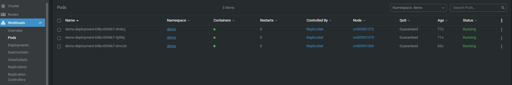
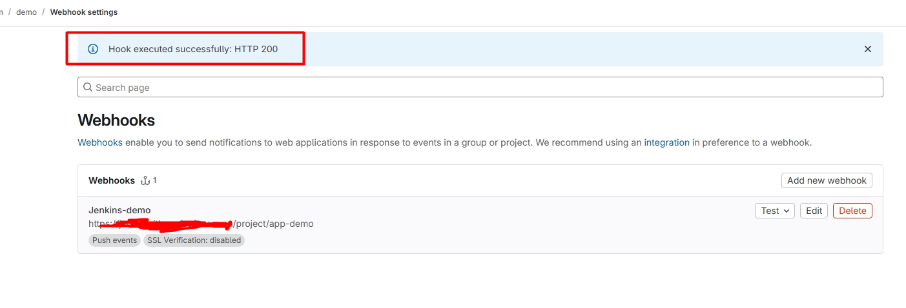

# Document Setup Jenkins And Build CI/CD Demo
## Setup Jenkins Server And Agent Node
1. Create a Dockerfile  and â docker-compose.yml
 copy Jenkins-Server to home/
 Run docker compose for create container jenkins server and jenkins angent
 cd /home/jenkins/
 create folder for data jenkins server: mkdir /home/jenkins/jenkins_home/
### Folder jenkins-server structure

| File | Description |
| ---- | ----------- |
| `/agent/Dockerfile` | File Build image jenkins agent node an package for necessary work |
| `docker-compose.yml` | File build Jenkins Server and Jenkins Agent node connecting to server |

* Some docker compose commands to create container
    #### Create container
    docker-compose up -d

    #### check container running or not
    docker ps -a
  
    

    #### Login Jenkins server and create Agent Node
    Create node agent-2
  
    
  
    copy secret for agent node JENKINS_SECRET on agent/Dockerfile
    
  
    set secret on docker compose and recreate container agent
    
  
    #### Remove container and recreate
    ##### Remove container agent current
    ```bash
      docker rm -f ID-CONTAINER
    ```
    ##### Build container Agent Jenkins using command
    ```bash
    docker-compose up -d
    ```
    check agent conntecing server
  
    

2. Create Project Pipeline on Jenkins for CI/CD
#### Select Item  Pipeline for Project
Fill in the following information
| General | Description |
| ---- | ----------- |
| `GitLab Connection` | Select the connection that has been setup in the system via Personal access tokens |
| `Triggers` | Make sure Build when a change is pushed to GitLab is selected for running CI/CD when a push trigger occurs |
| `Pipeline` | Make sure to select Pipeline script from SCM to automatically read the Jenkinsfile from the source code |
| `Script Path` | Leave the Jenkinsfile filename or absolute path |

Detailed configuration
Triggers

Generate secret for config webhook on gitlab

Pipeline


3. Create repository gitlab and setup webhook connect to jenkins project
On gitlab create project and go to settings -> Webhooks and Fill in the information
URL: Copy url on Trigger jenkins project "GitLab webhook URL: https://jenkins.demo/project/app-demo"
Secret token: Enter secret token Generate on project jenkins


## Setup CI/CD gitlab-ci and Jenkinsfile
### CI/CD using gitlab-ci.yml
Touch a file .gitlab-ci.yml on source code
We will create a gitlab-ci.yml file in the source code.
In this file, we will perform 4 actions: 
  - test: Test register connection
  - scan-app: scan source code with sonarque to ensure security holes are fixed
  - build: build image from dockerfile and push to registry
  - deploy: deploy to kubernetes system
Make sure you have a k8s cluster installed and context config
environment variables will be set on Settings => CI/CD => Variables

These environment variables will be taken from the gitlab ci env itself: CI_COMMIT_REF_NAME (name branch push), CI_COMMIT_SHORT_SHA (ID commit)
In stage: build, we will build the image from the docker file and tag the image to push to the registry. Here I create 2 types of tags: commit and latest to help debug if there are errors, and brach is master for deployment prod

  ```bash
  build:
    stage: build
    image: podman/stable:latest
    before_script:
      - podman login -u $USER -p $PASSWORD $REGISTRY
    script:
      - podman build -f docker/Dockerfile -t $TAG_COMMIT -t $TAG_LATEST .
      - podman push $TAG_COMMIT
      - podman push $TAG_LATEST
    only:
      - master
  ```
In stage: deploy, we will deploy the application to the k8s system, and will roll it out if the deployment process fails with a small check with if

  ```bash
  deploy:
    image: bitnami/kubectl:latest
    stage: deploy
    before_script:
      - echo "$KUBECONFIG_CONTENT" | base64 --decode > $KUBECONFIG
      - sed -i 's|IMAGE|'"$TAG_LATEST"'|g' docker/deployment.yaml
    script:
      - kubectl apply -f docker/deployment.yaml
      - if ! kubectl rollout status deployment/demo-deployment -n demo --timeout=60s; then
          echo "Deployment failed, rolling back..."; 
          kubectl rollout undo deployment/demo-deployment -n demo; 
          exit 1;
        fi
      - sleep 60
      - kubectl get pod -n demo
    only:
      - master
  ```

Note: we will have to create a docker/deployment.yaml file with kind as deployment and service to serve the process of uploading the application to the system.

After pushing the code to gitlab, the gitlab-ci file will perform the actions

Check the pipeline section


Checked on k8s and deployment and created 3 pods


Check website access


### CI/CD using Jenkinsfile
We will create a Jenkinsfile file in the source code.
In this file, we will perform 4 actions: 
  - test: Test register connection
  - scan-app: scan source code with sonarque to ensure security holes are fixed
  - build: build image from dockerfile and push to registry
  - deploy: deploy to kubernetes system
Make sure you have a k8s cluster installed and context config
environment variables will be set on Manage Jenkins => Credentials => and setup variables

These environment variables will be taken from the gitlab ci env itself: GIT_BRANCH (name branch push), GIT_COMMIT (ID commit)
In stage: build, we will build the image from the docker file and tag the image to push to the registry. Here I create 2 types of tags: commit and latest to help debug if there are errors, and brach is master for deployment prod

In the initial part, we will set the variable and get the variable information in credentials. Agent sẽ chọn agent-1 (or any)

  ```bash
  pipeline {
    agent { label 'agent-1' }
    environment {
      REGISTRY           = credentials('docker-registry')
      USER               = credentials('docker-username')
      PASSWORD           = credentials('docker-password')
      SONAR_TOKEN        = credentials('sonar-token')
      KUBECONFIG_CONTENT = credentials('kubeconfig-b64')
      KUBECONFIG         = "kubeconfig"
    }
  ```

In the first stage, we will create a tag variable for the containers that will push to the registry
  ```bash
  stages {
    stage('Tag Image') {
      steps {
        script {
          env.TAG_LATEST = "${env.REGISTRY}/${env.GIT_BRANCH}:latest"
          env.TAG_COMMIT = "${env.REGISTRY}/${env.GIT_BRANCH}:${env.GIT_COMMIT.take(7)}"
        }
      }
    }
  ```
In the next stages, we only allow it to run when the push command belongs to the master branch with the when option
  ```bash
    stage('Build Image') {
      when {
        expression {
          return env.GIT_BRANCH == "origin/master"
        }
      }
  ```

Note that, in the webhook configuration in step 3, we tested the connection successfully


Push code to gitlab to track CI/CD jenkins process


Check deployment and pod on kubernetes


Test connecting to website

